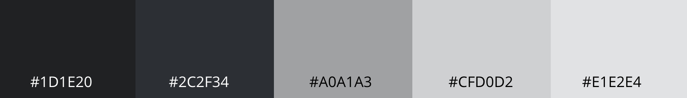
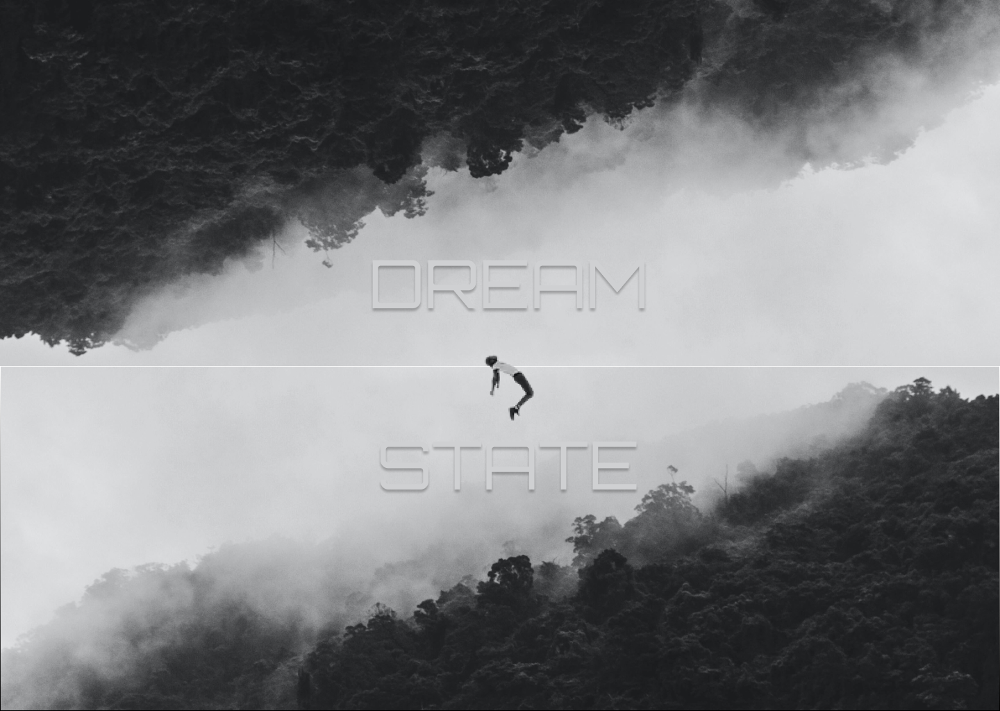
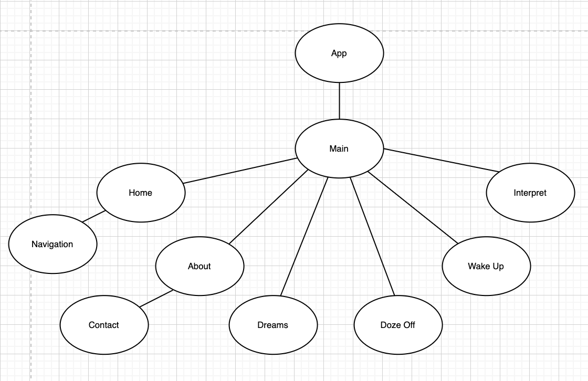
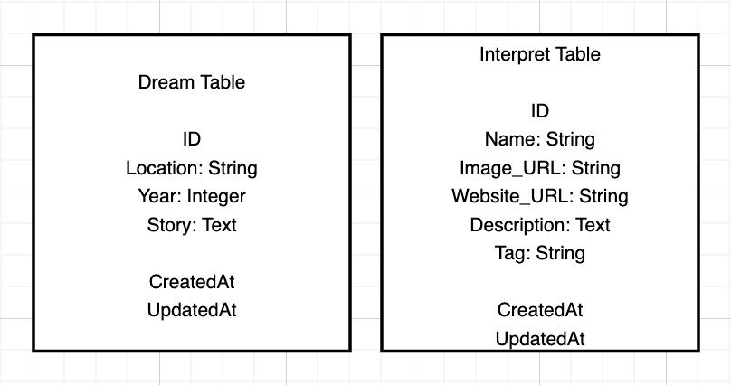

**DREAMSTATE** was made to support the African American communities around the world to give them an outlet to share their stories and experiences of their every day lives and struggles.  These stories of theirs are their personal experiences and realities and more likely than not to the outsider, seems like a dream.   

DREAMSTATE is a place where people can educate themselves, start being active in their communities to become better allies, support eachother, attend gatherings, spread awareness, etc.  

The more people see, hear and listen to eachother, the sooner this nightmare of a reality can end.

**Core Features**  
Any person on this has the ability to create a dream.  

**Goals**
* Outlet for the African American Community to safely, free of judgement, share their stories.
* Gives the world the chance to get a glimpse of what marginalized people experience and fear on an everyday basis.
* Serve as a stepping stone for anyone and everyone to get educated, aware, and active of the injustices committed on an everyday basis across all communities and countries.

## MVP 
#### Client (Front End)
Frontend - React  
Frontend Deployment - Netlify

#### Server (Back End)
Backend - Ruby on Rails  
Backend Deployment - Heroku

#### Design  
**Fonts**   
DreamState logo - Orbitron, sans-serif  
Links - Wire One, sans-serif  
Text - Open Sans, sans-serif  
Headers/Subheaders - Montserrat, sans-serif  
**Color Scheme**    
   

**WireFrame Images**   
 [Figma Site Map Renderings](https://www.figma.com/file/A76wKnES6uQsjwS0CudKCx/DreamState?node-id=14%3A450)   
 Desktop & Tablet Renderings are the same.   
Refer to Wireframes Folder in this repository for a detailed view of each page's rendering.

**Component Heirarchy**

      src
      |__ Assets/
        |__ images
      |__ Wireframes/
        |__ Wireframes.jsx
      |__ Components/
        |__ Home.jsx
        |__ About.jsx
        |__ Navigation.jsx
        |__ OneDream.jsx
        |__ Contact.jsx
        |__ Logo.jsx
        |__ Dreams.jsx
        |__ DozeOff.jsx
        |__ Contact.jsx
        |__ WakeUp.jsx
        |__ Interpret.jsx
        |__ Books.jsx
        |__ Tech.jsx
        |__ Beauty.jsx
        |__ Fashion.jsx
        |__ Food.jsx

**Component Breakdown**
Component | Type | State | Props | Description
------------ | ------------- | ------------ | ------------- | ------------ |
Home | Class | No | Yes | Contains random dream rendering. |
About | Functional | No | No | Contains description of app. |
Navigation | Functional | No | No | Contains Logo & Links: About, Dreams, Doze Off, Wake Up and Interpret. |
Logo | Functional | No | No | Neumorphism Text Effect of DreamState. |
Dreams | Class | No | Yes | Contains cards of specific dreams. |
One Dream | Class | Yes | No | Page rendering 1 specific dream that guest clicks on. |
Contact | Class | Yes | No | Contains form prompting guest to submit a dream for review. |
Doze Off | Class | Yes | No | Contains form for guest to submit questions, comments, concerns. |
Contact | Class | Yes | No | Contains contact form. |
Wake Up| Functional | No | No | Contains links to organizations and official donations sites, etc.  |
Interpret | Functional | No | No | Contains links, resources, black-owned companies, best-seller books and educational materials to bring more awareness to guest. |
Books | Functional | No | No | Sub-page of Interpret. |
Tech | Functional | No | No | Sub-page of Interpret. |
Beauty | Functional| No | No | Sub-page of Interpret. |
Fashion | Functional | No | No | Sub-page of Interpret. |
Food | Functional | No | No | Sub-page of Interpret. |

**Component Tree**
 

**ERD Model**   
   
To prevent spam and user harassment as well as protect user anonminity, all stories will be directed to a site-specific account where they will be filtered out.  Stories will be posted on a rolling-weekly basis, and spam won't be clogging the purpose of the site.   

A seperate database will be made for resrouces of black-owned businesses.

| Library | Purpose |
| ------------ | ------------ |
React | User interface rendering framework |
React Router | Front End Link and Route components|
React Animations | Homepage Logo and general page animations|
CORS | CORS enabling middleware |
Axios | Make front end API calls to backend |

## Post MVP
Once MVP is complete future features that would benefit this app and take it to the next level include but not limited to:

- Expand more categories of Interpret's resources.
- Sort function of Dreams: by Year, or by Location.
- Add a map for interactivity to see where Dreams are taking place.
